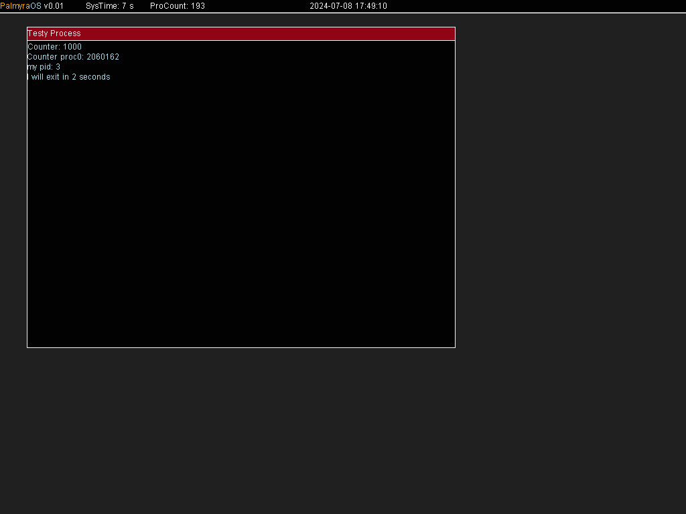

# PalmyraOS
An Educational Operating System based on x86 aiming for simplicity.

## Capabilities

Currently:

- Runs on x86 (intel i386) architecture
- Video Display (VESA)
- Dynamic Memory with Paging
- Multitasking (User / Kernel Spaces)
- Virtual File System

## Screenshots

Currently, it looks as follows:

