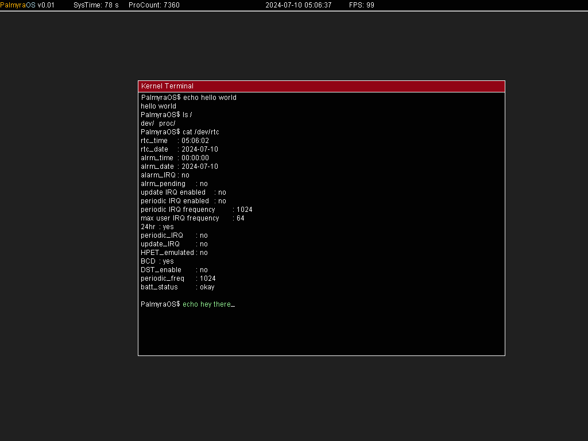

# PalmyraOS
An Educational Operating System based on x86 aiming for simplicity.

## Capabilities

Currently:

- Runs on x86 (intel i386) architecture
- Video Display (VESA)
- Dynamic Memory with Paging
- Multitasking (User / Kernel Spaces)
- Virtual File System

## Screenshots

Currently, it looks as follows:



## Tools

- GCC Compiler
- NASM (Netwide Assembler)
- Xorriso 1.5.4
- grub-mkrescue
- VirtualBox (optional)
- Qemu (optional)

## Third Party Code

Copyrights included in third party code:

- `core/std/tree.cpp` _For `std::set`_

## Getting started

using Qemu

```shell
qemu-system-i386.exe -cdrom bin/kernel.iso -boot d -m 1024 -S -gdb tcp::1234 -drive file="path/to/hard_disk.vdi",format=vdi,media=disk
```

